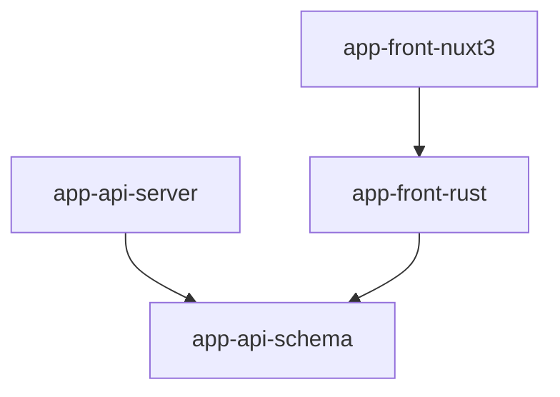

# rust-and-nuxt3-app

An example of an application architecture using Rust and Nuxt3 for the frontend and Rust for the backend.

## Dependency Graph



## Steps to create the structure of this repository from scratch

### Setup rust crates

1. Create crates
```bash
cargo new --lib app-api-schema
cargo new --bin app-api-server
cargo new --lib app-front-rust
```

2. Add the `[lib]` section to the `app-front-rust/Cargo.toml` file

```toml
[lib]
crate-type = ["cdylib", "rlib"]
```

### Setup nuxt3 package

1. Create a package (ref: https://nuxt.com/docs/getting-started/installation)
```bash
npx nuxi@latest init app-front-nuxt3
```
and select yarn for package manager

2. Add packages for using wasm (ref: https://github.com/nshen/vite-plugin-wasm-pack?tab=readme-ov-file#install-manually)
```
yarn add vite vite-plugin-wasm-pack -D
```

3. Add a plugin configuration to vite.config.js (ref: https://github.com/nshen/vite-plugin-wasm-pack?tab=readme-ov-file#usage)
```js
import wasmpack from 'vite-plugin-wasm-pack';

export default defineNuxtConfig({
  ssr: false,
  vite: {
    plugins: [wasmpack('../app-front-rust')]
  }
});
```

4. Add scripts for building wasm in package.json
```diff
  "scripts": {
    "build": "nuxt build",
-   "dev": "nuxt dev",
-   "generate": "nuxt generate",
+   "dev": "yarn wasm && nuxt dev",
+   "generate": "yarn wasm && nuxt generate && cp ../app-front-rust/pkg/*.wasm ./dist/_nuxt",
    "preview": "nuxt preview",
    "postinstall": "nuxt prepare",
+   "wasm": "wasm-pack build ../app-front-rust --target web"
  },
```

## License

Licensed under either of

 * Apache License, Version 2.0
   ([LICENSE-APACHE](LICENSE-APACHE) or http://www.apache.org/licenses/LICENSE-2.0)
 * MIT license
   ([LICENSE-MIT](LICENSE-MIT) or http://opensource.org/licenses/MIT)

at your option.

## Contribution

Unless you explicitly state otherwise, any contribution intentionally submitted
for inclusion in the work by you, as defined in the Apache-2.0 license, shall be
dual licensed as above, without any additional terms or conditions.
